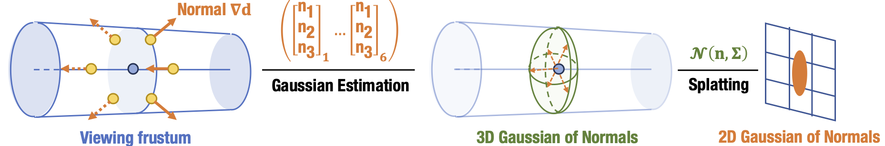
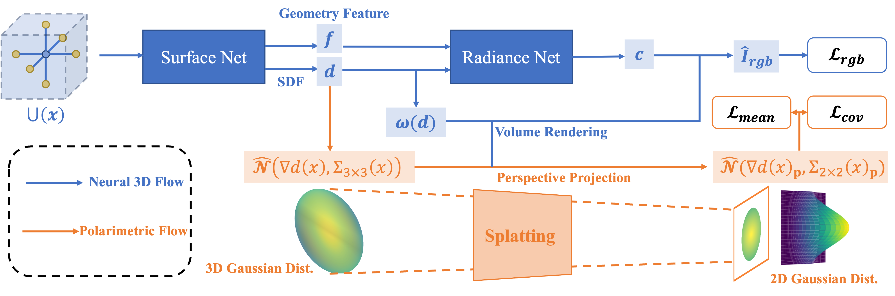

# GNeRP: Gaussian-guided Neural Reconstruction of Reflective Objects with Noisy Polarization Priors (ICLR 2024)

## [Project Page](https://yukiumi13.github.io/gnerp_page/) |  [Paper](https://yukiumi13.github.io/gnerp_page/gnerp_camera_ready.pdf) | [Dataset](https://drive.google.com/drive/folders/19j1Px5hT74dpZwKRgX0pfycr35AsbKgj?usp=sharing) | [Citation](##citation)

This is the official repo for the implementation of [GNeRP: Gaussian-guided Neural Reconstruction of
Reflective Objects with Noisy Polarization Priors](https://iclr.cc/virtual/2024/poster/17774), Yang LI, Ruizheng WU, Jiyong LI, Ying-Cong Chen.

📣:<font color=red> **I'm actively looking for Ph.D. positions.** </font>

## Abstract
* 🚀 We proposed Gaussian Splatting of surface **normals** dedicated to reflective objects.

* 🚀 It is built upon NeuS and supervised by **Polarization Priors**.


## Environment Setup
 
The repo is built upon pytorch 1.13.1 with CUDA 11.6. Additional packages are listed in ```requirements.txt```.

## Training and Inference

### Coordinates System Conventions

The coordinates system used in ray casting follows [OpenCV](https://docs.opencv.org/4.x/d9/d0c/group__calib3d.html). It is **NOTED** that the origin of **POLARIZATION** image plane is at the **RIGHT-BOTTOM** corner of the image, while the origin of Radiance image plane is at the **LEFT-TOP** corner of the image. It determines the formulation of AoP Loss in the code. For details, please refer to PolRef Dataset.

For custom datasets, coordinate system conventions should be followed strictly, which can be checked by the visualization tools ```tools/{vis_camera, vis_ray, vis_surface_and_cam}.py``` and ``` dataio/PolData.py```. 

### Data Formats

The camera parameters are stored as JSON files in the following format:

```
{
    "w2c_mat_0": [
        [R_3x3,    t_3x1],
        [0.0_{3x1},  1.0]
    ],
    ...
    "intrinsic": [
        [fx,0.0,tx],
        [0.0,fy,ty],
        [0.0,0.0,1.0]
    ]
}
```
The scripts converting other formats can be found in ```dataio/{camera_npy_parser,camera_txt_parser}.py```.

AoP and DoP images are stored as Numpy Arrays. The pre-procsess scripts from the raw polarization capture to radiance and AoP/DoP images are provided in ```dataio/{lucid_isp, mitsuba_isp, pandora_isp}.py```. Samples can be found in PolRef Dataset.
### Train a model from scratch

Run the evaluation script with

```python -m train --config configs/hyper.yaml --base_config configs/pnr.yaml  ```

### Extract Geometry
Typically, meshes can be extracted from checkpoints using the following command:

```python sdf2mesh.py --resolution 512 --json surface.json  ```

Moreover, we provide a script ```sdf2mesh_volsdf.py```  of extract method in VolSDF, which included additional post-process procedures. It is much slower but the mesh is smoothed.
## PolRef Dataset
The dataset is split into real scenes and synthetic scenes. Camera parameters following the convention. The data is organized as follows (similar to [PANDORA](https://github.com/akshatdave/pandora)):
<pre>
+-- data
|   +-- ironman
|       +-- aop
|       +-- dop
|       +-- images
|       +-- masks
|       +-- masks_ignore
|       +-- cameras.json
|       
    +-- ...
</pre>

## TODO

- [x] release training code.
- [x] release PolRef Synthetic Dataset.
- [ ] release PolRef Real Dataset.

## Citation


If you find our work useful in your research, please consider citing:

```
@article{li24gnerp,
    title={GNeRP: Gaussian-guided Neural Reconstruction of Reflective Objects with Noisy Polarization Priors},
    author={Li, Yang and Wu, Ruizheng and Li, Jiyong and Chen, Ying-Cong},
    journal={ICLR},
    year={2024}
}
```


## Acknowledgments

Our code is partially based on [neurecon](https://github.com/ventusff/neurecon) project and some code snippets are borrowed from [Ref-NeuS](https://github.com/EnVision-Research/Ref-NeuS). Thanks for these great projects. 
